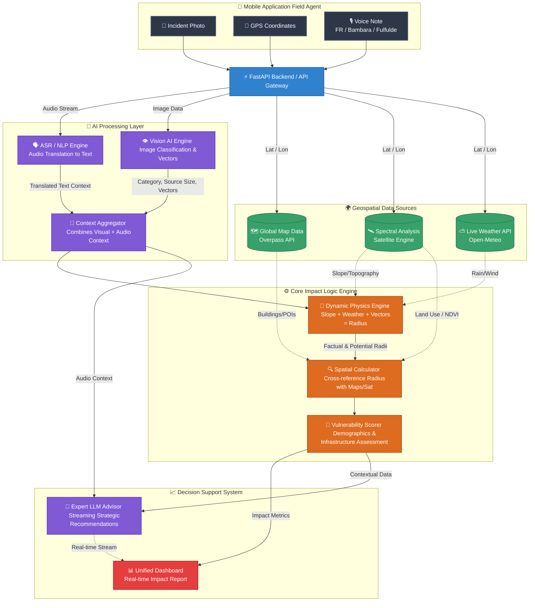

# 🏗️ Map Action Impact Engine - Architecture & Integration Flow

This document presents the complete technical architecture and integration flow of the Map Action platform. It is designed for technical meetings to illustrate how field data (Image, GPS, Voice) is processed through various AI and Geospatial layers to produce a unified, strategic impact report.

## 📊 System Architecture Diagram

---

## 📝 Component Breakdown & Data Flow

### 1. 📱 Mobile Input Layer
Field agents use the Map Action mobile application to capture the reality on the ground. To ensure maximum accessibility and speed, the app collects three key data points:
*   **Incident Photo**: Visual proof of the disaster (Flood, Pollution, Fire).
*   **GPS Coordinates**: Exact Latitude and Longitude for precise geospatial mapping.
*   **Voice Note**: A critical new feature. Users can describe the situation orally in their native language (**French, Bambara, or Fulfulde**). This bypasses literacy barriers and allows for rapid reporting in high-stress situations.

### 2. 🧠 AI Processing Layer (Multimodal)
Once the payload reaches the **FastAPI Backend**, the data is split into specialized AI pipelines:
*   **ASR/NLP Engine**: Processes the voice note using Automatic Speech Recognition (ASR). It identifies the language (e.g., Bambara), transcribes it, and translates it into a standardized text format (French/English). This text provides crucial *invisible context* (e.g., "The water smells like chemicals" or "People are trapped").
*   **Vision AI Engine**: Analyzes the photo to classify the incident, estimate the physical size of the source, and identify **Spread Vectors** (e.g., wind, water current).
*   **Context Aggregator**: Fuses the translated voice context with the visual data.

### 3. 🌍 Geospatial Data Acquisition
In parallel, the backend fetches real-time environmental data using the GPS coordinates:
*   **Weather Data**: Current wind speed, temperature, and precipitation.
*   **Satellite Data**: Topography (slope), Land Use (Urban/Agricultural), and vegetation indices (NDVI).
*   **Map Data**: OpenStreetMap infrastructure (hospitals, schools, residential buildings).

### 4. ⚙️ Core Impact Logic Engine
This is the heart of the system.
*   **Dynamic Physics Engine**: Instead of drawing a static circle, it calculates a **Factual Radius** and a **Potential Risk Radius** by combining the AI spread vectors (e.g., water) with the environmental physics (e.g., slope and rain).
*   **Spatial Calculator & Vulnerability Scorer**: It filters the map data within these dynamic radii. If map data is missing, it uses satellite Land Use data to perform a **Probabilistic Injection** (estimating population density based on the urban footprint).

### 5. 📈 Decision Support System
*   **Expert LLM Advisor**: A custom fine-tuned Transformer model receives the entire JSON payload (Impact metrics, demographics, weather) PLUS the translated Voice Note context. It streams strategic, actionable recommendations to decision-makers in real-time.
*   **Unified Dashboard**: Displays the quantified impact (Exposed population, threatened infrastructure) alongside the live AI chat, enabling rapid humanitarian logistics deployment.
